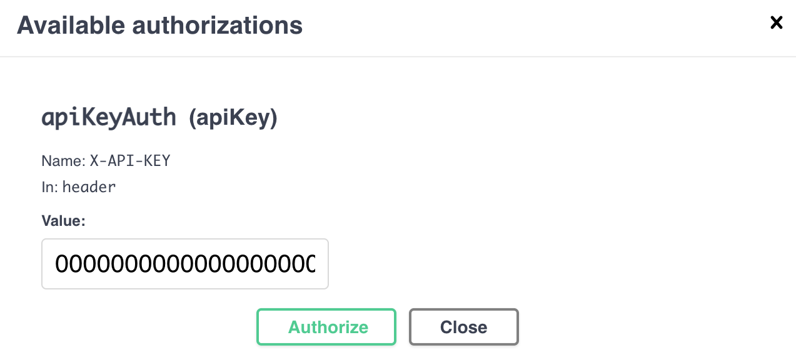

## API Key

It's a good practice to use API key to limit the access to your full node's rest endpoints.

### API Key Setup

Please add the following to your `user.conf` by replacing the zeros with your own key (>= 32 characters).

```
alephium.api.api-key = "0000000000000000000000000000000000000000000000000000000000000000"
```

Restart your full node to make this take effect.

#### API Key Generation

On GNU/ Linux: `cat /dev/urandom | tr -dc 'a-zA-Z0-9' | fold -w 48 | head -n 1`

### Use API Key

1. Click on the `Authorize` button on the top right of your Swagger UI:
   

2. Fill in the value box with your key and click the authorize button:
   

Now you could use Swagger UI as if there is no API key.

## How to access the Swagger UI of my full node on another computer in the same subnet ?

1. Add the following to your `user.conf` and restart your full node.

```
alephium.api.network-interface = "0.0.0.0"
```

2. Change the `host` of Swagger UI to be the IP of your full node.

## Error "java.lang.AssertionError: assumption failed"

This error often occurs due to connection loss during node synchronization and means that some of the files are corrupted.
To fix the problem:

1. Delete the folder .alephium `rm .alephium`

2. Restart the node and wait for synchronization `java -jar alephium-1.3.2.jar`

## Moving the Alephium data folder

Many users prefer to keep the Alephium data folder on a different disk than the primary boot disk. To do so with the Alephium full node jar, you can use the `ALEPHIUM_HOME` environment variable:

1. Stop the Alephium full node jar
2. Move the Alephium data folder (normally at `%userprofile%\.alephium` for Windows or `~/.alephium` for Linux and macOS) to the new location
3. Add an environment variable `ALEPHIUM_HOME` to the system pointing to the new location. You can either do this at the system level or simply create a batch file that sets the variable prior to starting the Alephium jar.
4. Restart the Alephium node

If using the docker full node, then simply change the mounted folder definitions in the docker file to point to the new home then restart.

## Customize Logging

There are several environment variables used for logging:

- `ALEPHIUM_LOG_LEVEL` could change the console log level.
- `ALEPHIUM_ENABLE_DEBUG_LOGGING` could enable debug logging.
- `ALEPHIUM_HOME` could change the home folder of the full node, therefore the folder of logs

Below is an example with all of the possible logging options:

```
ALEPHIUM_HOM=<folder> ALEPHIUM_LOG_LEVEL=<DEBUG | INFO | WARN | ERROR> ALEPHIUM_ENABLE_DEBUG_LOGGING=<true | false> java -jar alephium-1.x.x.jar
```

It's also possible to override the [logging configuration file](https://github.com/alephium/alephium/blob/master/flow/src/main/resources/logback.xml) of Alephium.

```
java -Dlogback.configurationFile=/path/to/config.xml alephium-1.x.x.jar
```
