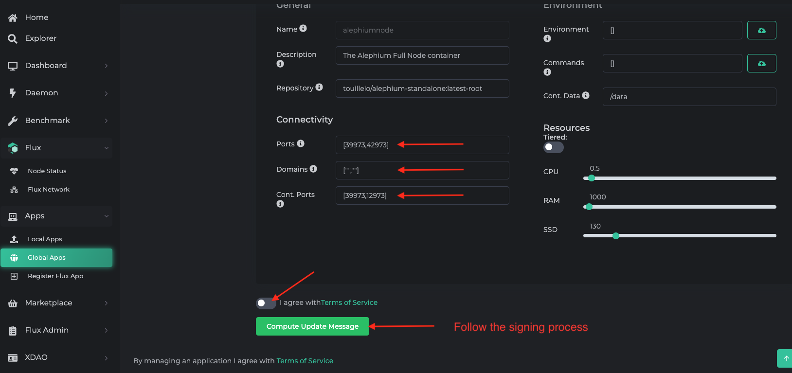

import UntranslatedPageText from "@site/src/components/UntranslatedPageText";

<UntranslatedPageText />

In this guide we'll learn how to run a full node on [Flux](https://runonflux.io/),
and how to expose the API.

How to get started with Flux is out of scope for this page, but you can refer to
Flux official documentation if needed. We will assume here that you own enough Flux to start
an App.

## Get the Full Node App from the Marketplace

[https://home.runonflux.io/apps/marketplace?q=alephium](https://home.runonflux.io/apps/marketplace?q=alephium)
Select the App named *AlephiumNode*.

## Expose the API

By default, the Full Node App only has the P2P port (39973 on Flux nodes) exposed. If you want to expose the API port, you'll need to update the specification of your Flux App as follow. Please keep in mind that exposing the API might be a security concern unless you know what you're doing.

1. Manage your application

2. Update the specifications

3. Configure the connectivity to expose the container port 12973. In the screenshot below the port 42973 has been arbitrariliy choosen and will be exposing the API. Any other valid port would work. Compute the signing message and follow the signing process to broadcast the specifications update across the network.

4. Softly redeploy your application to take into account the specifications update.

That's it, your API is now exposed through the Automatic endpoint containing `_42973` (or the different port your specified), you can easily validate with the API endpoint `/infos/version`, i.e. something like `https://alephiumnode1708292985626_42973.app.runonflux.io/infos/version`.
