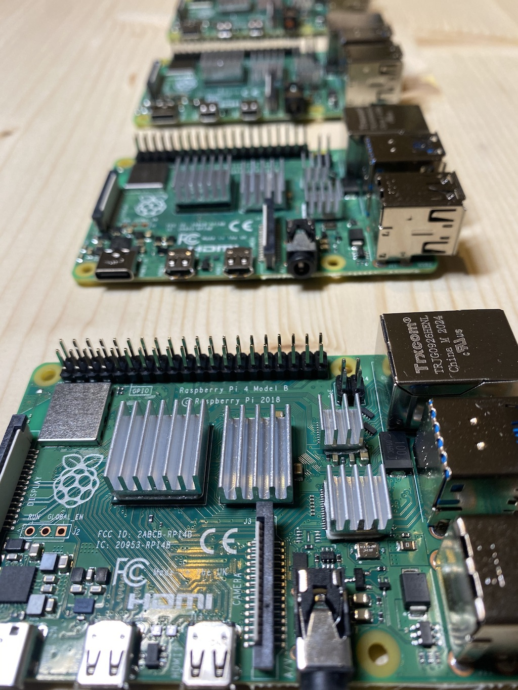

import UntranslatedPageText from "@site/src/components/UntranslatedPageText";

<UntranslatedPageText />


In diesem Leitfaden werden wir lernen:

- Wie man einen Raspberry Pi 4 installiert
- Wie man eine Docker-Instanz eines Alephium-Full-Nodes ausführt

## Wie man einen Raspberry Pi 4 installiert

Dieser erste Abschnitt wird meinen persönlichen Weg zur Installation von Ubuntu 20.04 Server auf einem Raspberry Pi 4 beschreiben.
Es erfordert einen Raspberry Pi 4 (offensichtlich), eine SD-Karte (mindestens 8 GB) und einen SD-Kartenleser, um die SD-Karte zu flashen.
Es wird mit Shell-Befehlen von macOS illustriert, aber du findest das Äquivalent in Windows.


Zuerst werden wir die Installation von Ubuntu konfigurieren. Hierfür verwenden wir cloud-init, da es in Ubuntu 20.04 und höher integriert ist. Diese Konfiguration erstellt einen Benutzer (abweichend vom standardmäßigen  `ubuntu`) und installiert einige Pakete.

### Boot-Konfiguration einrichten

Füge den unten stehenden Ausschnitt in eine Datei mit dem Namen `user-data.yml` ein und speichere sie. Diese erstellt einen Benutzer `alephium` mit dem Passwort `installfest2021`.
Du kannst den Inhalt dieser Datei anpassen, wenn du weist, was du tust.

```yaml
#cloud-config

hostname: alephium

ssh_pwauth: true

users:
  - name: alephium
    gecos: "alephium"
    sudo: ALL=(ALL) NOPASSWD:ALL
    shell: /bin/bash
    groups: adm,sudo,docker
    plain_text_passwd: installfest2021
    lock_passwd: false
    chpasswd: { expire: false }
#    ssh_authorized_keys: # Optional hier den SSH-Schlüssel hinzufügen, wenn Sie das Passwort nicht verwenden möchten.
#      - ssh-ed25519 xxxxxxxxxxxxxxxxxx

packages:
  - apt-transport-https
  - ca-certificates
  - curl
  - gnupg-agent
  - software-properties-common
  - git
  - openssh-server
  - docker.io
  - docker-compose

runcmd:
  - systemctl start docker
  - systemctl enable docker

package_update: true
package_upgrade: true

power_state:
  mode: reboot
```

### Flashen der SD-Karte

Nun werden wir die SD-Karte mit dieser Datei flashen. `user-data.yml`.

Ich nutze dafür das Tool [Flash](https://github.com/hypriot/flash/), welches die schwierigste Arbeit für uns erledigt.

```shell
curl -LO https://github.com/hypriot/flash/releases/download/2.7.2/flash
chmod +x flash

./flash --userdata user-data.yml https://cdimage.ubuntu.com/releases/20.04/release/ubuntu-20.04.4-preinstalled-server-arm64+raspi.img.xz
```

Der oben genannte Befehl wird um eine Bestätigung bitten, dass `/dev/disk2` die SD-Karte und nicht deine Festplatte ist, und wird nach dem Passwort fragen, da das Flashen einer SD-Karte Administratorrechte erfordert.

Sobald der oben genannte Befehl abgeschlossen ist, kannst du die SD-Karte in deinen Raspberry Pi einlegen und ihn einschalten. Es dauert einige Minuten, bis der erste Start vollständig ausgeführt ist, anschließend ist dein Raspberry Pi bereit zur Verwendung. Sobald der Knoten bereit ist, kannst du dich per SSH anmelden, indem du `alephium` als Benutzernamen und `installfest2021` als Passwort verwendest!

```shell
ssh alephium@alephium
```

Wenn der Host `alephium` unbekannt sein sollte, musst du nach der IP-Adresse des Knotens suchen, höchstwahrscheinlich auf der Konfigurations-Seite/App deines Routers.

Und das wars, dein Raspberry Pi läuft mit Docker unter Ubuntu 20.04 und ist bereit, einen vollständigen Alephium-Knoten auszuführen.

🚀



## Wie man eine dockerisierte Instanz eines vollständigen Alephium-Knotens ausführt:

Diese zweite Sektion ist nicht spezifisch für einen Raspberry Pi, sondern kann auf jeden Server/VM/Computer mit SSH-Zugang eingerichtet werden. Wir werden die einfachste Version eines Alephium-Full-Node mit Docker ausführen und dann Schritt für Schritt vorgehen, um die Einrichtung bequemer zu gestalten.

Als Voraussetzung für diesen Abschnitt müssen wir einen Server mit SSH-Zugriff haben, der genauer gesagt Ubuntu 20.04 oder höher ausführt. Der vorherige Abschnitt erklärt, wie das mit einem Raspberry Pi gemacht wird, aber eine AWS EC2-Instanz würde ebenfalls funktionieren.

### Mit dem Server verbinden

Das sollte ein einfacher Schritt mit dem `ssh` -Befehl sein. Führe folgendes aus:

```shell
ssh alephium@alephium
```

### Docker und Docker-Compose installieren

Lass uns schnell Docker und Docker Compose installieren, damit wir bereit sind, die Alephium-Full-Node auszuführen.

Nach dem SSH-Zugriff führe die folgenden Befehle aus:

```shell
sudo apt install -y docker.io docker-compose
```

Großartig, Docker sollte nun ausgeführt werden:

```shell
docker ps
```

### Führe die Full Node aus

Nun kannst du die Full Node mit einer einzigen Zeile wie folgt ausführen:

```shell
docker run -it --rm -p 12973:12973 --name alephium alephium/alephium:latest
```

### Docker-compose

Docker-Compose ist eine etwas bequemere Möglichkeit, einen Container auszuführen, insbesondere wenn der Befehl Volumes, mehr Ports, Umgebungsvariablen usw. enthält.


Hier ist die Servicedefinition, die du in einer `docker-compose.yml`-Datei platzieren und einfach `docker-compose up -d`  aufrufen kannst, um deine Full Node von dieser Definition aus zu starten.

```yaml
version: "3"
services:
  broker:
    image: "alephium/alephium:latest"
    restart: unless-stopped
    ports:
      - 9973:9973/tcp
      - 9973:9973/udp
      - 10973:10973/tcp
      - 12973:12973/tcp
```
