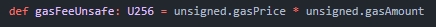

import UntranslatedPageText from "@site/src/components/UntranslatedPageText";

<UntranslatedPageText />

Dies ist eine allgemeine Liste nützlicher Konzepte zur besseren Verständnis von Alephium im Besonderen und Blockchains.

## A

### Alephium

Alephium ist die erste funktionsfähige L1-Blockchain, die erfolgreich das sharding-Prinzip implementiert und die Konzepte von PoW und UTXO skalierbar und verbessert umsetzt. Diese Blockchain vereint Dezentralisierung, Selbstbestimmung und Sicherheit mit herausragender Leistung, Zugänglichkeit und Energieeffizienz. Das Ergebnis ist ein entwicklerfreundliches Netzwerk, das speziell für die Optimierung von DeFi- und Smart-Vertragsanwendungen konzipiert wurde.

Von seinem technischen Design bis zu seinen Schnittstellen wurde Alephium geschaffen, um den Herausforderungen der Zugänglichkeit, Skalierbarkeit und Sicherheit zu begegnen, denen dezentrale Anwendungen heute gegenüberstehen.

## B

### Blake 3 Algorithmus (Hash Funktion)
[Blake 3 Algorithmus](https://github.com/BLAKE3-team/BLAKE3) ist eine kryptografische Hash-Funktion. Eine Hash-Funktion ist eine mathematische Funktion, die eine Eingabesequenz beliebiger Länge entgegennimmt und sie in eine Ausgabesequenz fester Länge umwandelt. Die Ausgabesequenz fester Länge wird als Hash-Wert bezeichnet.

Hashfunktionen haben viele Anwendungsfälle in einer Blockchain: im [Merkle Tree](#merkle-tree), im Proof-of-Work-Konsens, bei digitalen Signaturen und in der Blockchain selbst (da jeder Blockkopf(Block-Header) in einem Block in der Blockchain den Hash des vorherigen Blockkopfs enthält). Bitcoin verwendet beispielsweise den [SHA-256.](https://en.wikipedia.org/wiki/SHA-2)

Alephium verwendet den Blake-3-Algorithmus als seine kryptografische Hash-Funktion für das Mining.

### Block Reward (Blockbelohnung)

Die Blockbelohnung ist ein wirtschaftlicher Anreiz für die Miner, ihre Aufgabe der Sicherung des Netzwerks zu erfüllen.

Sie wird in der nativen Token der Blockchain gezahlt. In der Regel ist sie höher, wenn das Netzwerk klein und neu ist, und nimmt im Laufe der Zeit ab, wenn es reift.

[Blockbelohnung GitHub Implementierung](https://github.com/alephium/alephium/blob/master/protocol/src/main/scala/org/alephium/protocol/mining/Emission.scala)

### Blockgröße

Die Blockgröße ist die Datenbegrenzung, die jeder Block verarbeiten kann. 

Sie kann auf verschiedene Arten gemessen werden. In einigen Blockchains wird sie durch die tatsächlichen Datenmengen ausgedrückt, die der Block tragen kann (beispielsweise beträgt die Blockgröße bei Zcash 2 MB). In anderen Blockchains hängt die Blockgröße mit der berechneten Verarbeitungsgrenze zusammen, die das Netzwerk verbrauchen kann (üblicherweise in Gas ausgedrückt). Die Blockgrößen von Ethereum und Alephium werden auf diese Weise gemessen.

### Blockzeit

Die Blockzeit ist die Zeit, die benötigt wird, um die Transaktionen innerhalb eines Blocks zu berechnen und ihn an das Netzwerk zu senden.

Transaktionen werden in einem Block gesammelt und von den Minern (oder Validatoren in PoS-Blockchains) überprüft. In der Regel wird die Blockzeit von der Mining-Schwierigkeit beeinflusst, da sie angepasst wird, um die Rechenkapazität (Hashrate) des Netzwerks über eine bestimmte Zeitperiode widerzuspiegeln.

Das Alephium-Netzwerk hat eine Schwierigkeitsanpassung bei jedem Block und eine erwartete Blockzeit von **64 sekunden**.

Additional resources: [Artikel zu Blockzeit and Blockgröße](https://medium.com/@alephium/block-time-and-block-size-16e37292444f)

### Bridge

Eine Bridge ist ein Protokoll, das separate Blockchains verbindet, um Interaktionen zwischen ihnen zu ermöglichen. Jede Blockchain hat normalerweise ihre eigenen technologischen Merkmale und verfügt nicht über eine native Möglichkeit zur Kommunikation mit anderen Protokollen. Die Bridge besteht daher aus einer Gruppe von Smart Contracts, die diese verschiedenen Ökosysteme miteinander verbinden.
 
Eine Bridge kann spezialisierter sein und nur eine Art von Interaktion ermöglichen (wie zum Beispiel Token-Transfers) oder sie kann allgemeiner sein und jeglichen Datenaustausch zwischen den verbundenen Blockchains ermöglichen.

## C

## D

## E

## F

## G

###  Gast Amount Spent (Gasbetrag ausgegeben)

Gas Spent ist die Menge an Berechnungen, die der Miner verwendet, um die Transaktionen auszuführen. Je mehr Funktionen die Transaktion hat, desto komplexer ist ihre Ausführung, und desto mehr Gas wird ausgegeben. 

Derzeit gibt es als Spam-Schutz eine Mindestgrenze von 20.000 Gas für jede Transaktion auf Alephium, was bedeutet, dass die Transaktionsgebühr mindestens 0,002 ALPH betragen wird.

Mit zunehmender Reife des Netzwerks wird dies gelockert, und der Markt wird den Preis für Transaktionsgebühren festlegen.

### Gaspreis

Dies ist der monetäre Wert des Gases. Gas wird als der Rechenaufwand definiert, um einen Befehl in einer Blockchain auszuführen. Der Gaspreis ist der monetäre Gegenwert, um die vom Miner durchgeführte Arbeit zu bezahlen. 

Der aktuell niedrigste mögliche Gaspreis auf Alephium beträgt 10^-7 ALPH oder 0,0000001 ALPH.

### Genesis Block

Ein Genesis-Block ist der Name des allerersten Blocks, der jemals in einer Blockchain gemined wurde. Da die Blöcke übereinander gestapelt werden, bildet der Genesis-Block das Fundament oder den Anfang der Blockchain.

Er wird gelegentlich auch als Block 0 oder Block 1 bezeichnet. Wenn ein Block an die Blockchain übertragen wird, verweist er auf den vorherigen Block. Da es keinen vorherigen Block zum Verweisen gibt, sind Genesis-Blöcke in der Regel im Softwarecode fest codiert.

Der Genesis-Block von Alephium wurde am 8. November 2021 gemined.

## H

### Hard Fork (Harte Gabel)

Ein Hard Fork tritt auf, wenn ein bedeutendes Upgrade des Protokolls eines Netzwerks dazu führt, dass Knoten oder Benutzer, die die vorherige Version ausführen, nach dem Upgrade keine Transaktionen mehr senden oder validieren können.

Da das Upgrade optional ist, entscheiden sich manchmal einige der Knoten oder Benutzer dagegen, es durchzuführen, wodurch ab diesem Zeitpunkt eine unterschiedliche Version der Blockchain entsteht. Das geschah zum Beispiel bei Ethereum und Ethereum Classic.

## I

## J

## K

## L

## M

### Merkle Tree (Merkle-Baum)

Ein Merkle-Tree [ist eine Struktur](https://en.wikipedia.org/wiki/Merkle_tree), die in einer Blockchain verwendet wird, um Daten effizienter und sicherer zu komprimieren.
Die Blockchain packt die Transaktionen in Blöcken. Jeder Block hat einen Header, und dieser Header hat einen Hash. Dieser Hash wird im Merkle-Baum gespeichert. Der Hash aus dem Merkle-Baum wird verwendet, um zu überprüfen, dass ein Datensatz mit dem ursprünglichen Satz von Transaktionen identisch ist, ohne auf den Inhalt innerhalb des Blocks zugreifen zu müssen. Wenn dies visualisiert wird, ähnelt diese Struktur einem Baum und kann auch als "binärer Hash-Baum" bezeichnet werden.

Zum Beispiel verwendet Alephium drei Merkle-Bäume pro Gruppe, um Assets-UTXOs, Vertragslogik und Vertragszustand zu speichern. 

### Maximal Extractble Value (MEV)

Miner oder [Maximal Extractable Value (MEV)](https://ethereum.org/en/developers/docs/mev/) bezieht sich auf den Wert, der durch das Mining eines Blocks über die standardmäßige Blockbelohnung und Gasgebühren hinaus durch Ändern, Hinzufügen oder das Entfernen von Transaktionen in einem Block erzielt wird.

Diese Differenz wird von Akteuren angeboten, die als "Sucher" bezeichnet werden und den Mempool analysieren, um Profitmöglichkeiten zu finden, indem sie Informationen zu einer bestimmten Transaktion ersetzen, wie beispielsweise den Sender oder Empfänger. Um die Wahrscheinlichkeit zu erhöhen, dass ihre Transaktion vom Miner ausgewählt wird, um Teil des nächsten produzierten Blocks zu sein, sind sie bereit, eine viel höhere Gasgebühr als die Durchschnittsgebühr zu zahlen und somit einen Teil des Gewinns abzugeben oder zu "teilen".

### Mining Reward

Die Belohnung für neu generierte Blöcke in Alephium wird auch als Mining Reward (MR) bezeichnet. Nach der Verteilung werden die [Block Rewards](#block-reward) für 500 Minuten gesperrt.

Die Mining-Belohnung ist durch zwei Kurven gebunden, die auf Hashrate und Zeitstempel basieren. Zu einem bestimmten Zeitpunkt und für eine gegebene Hashrate entspricht die Belohnung pro Block dem Minimum zwischen der zeitbasierten Belohnung und der hashrate-basierten Belohnung.

Block Reward = min( zeitbasierte Belohnung, hashrate-basierte Belohnung ).

Zusätzliche Ressourcen: [Alephium Block Rewards](https://medium.com/@alephium/alephium-block-rewards-72d9fb9fde33)

### Multisig

Multisig oder Multisignatur ist der Prozess, bei dem mehr als ein privater Schlüssel erforderlich ist, um eine Transaktion zu co-signieren, bevor sie an das Netzwerk übertragen wird. Es wird als zusätzlicher Sicherheitsschritt verwendet.

In der Regel wird die Multisig-Konfiguration so konzipiert, dass eine bestimmte Transaktion nur dann genehmigt und versendet werden kann, wenn ein vordefiniertes Quorum von Unterzeichnern erreicht wird. Zum Beispiel erfordert eine Multisig mit einer 5-von-9-Konfiguration ein Quorum von 5 Unterzeichnern (aus neun potenziellen Mitunterzeichnern), um die Transaktion gemeinsam zu unterzeichnen, bevor sie gesendet werden kann.

Alephium’s [Full Node Wallet](/wallet/node-wallet-guide) unterstützt Multisig Adressen

## N

## O

## P

### Proof of Less Work (or PoLW)

Ähnlich wie der Proof-of-Work für Bitcoin oder der Proof-of-Stake für Ethereum (nach dem Merge) ist PoLW der Konsensalgorithmus von Alephium. Er optimiert den Energieverbrauch des Netzwerks, ohne dabei die Sicherheit und Dezentralisierung zu beeinträchtigen. Er wird aktiviert, wenn das Netzwerk eine kumulierte Hashrate von 1 Eh/s überschreitet.

Danach internalisiert es teilweise die Kosten für das Minen eines neuen Blocks, indem es einen Coin-Burning-Mechanismus in den Blockvalidierungsprozess integriert, was dazu beiträgt, eine Begrenzung der insgesamt benötigten Rechenleistung zu fördern. Bei gleichen Netzwerkbedingungen würde Alephium nur ⅛ der Energie verbrauchen, die beim Bitcoin-Mining verbraucht wird.

Zusätzliche Ressourcen: [TECH TALK #1 — Der ultimative Leitfaden zu Proof-of-Less-Work, dem Universum und allem anderen...](https://medium.com/@alephium/tech-talk-1-the-ultimate-guide-to-proof-of-less-work-the-universe-and-everything-ba70644ab301)

## Q

## R

## S

### Sharding 

Sharding ist eine Strategie des Datenbankmanagements, die große Datenbanken in kleinere, schnellere und leichter zu verwaltende Abschnitte aufteilt.

Diese kleineren Teile werden als [“shards”](https://en.wikipedia.org/wiki/Shard_(database_architecture)) bezeichnet, was „ein kleiner Teil eines Ganzen“ bedeutet. Sharding wird verwendet, wenn die benötigte Rechenleistung für die Datenbank die Verarbeitungskapazität eines einzelnen Computers übersteigt. Sharding wird notwendig, wenn die Größe der Blockchain die Verarbeitungsleistung der virtuellen Maschine und des Netzwerks übersteigt. Sharding zerlegt die Hauptblockchain in separate Segmente, und die Knoten verifizieren nur einen Teil der Transaktionen, was eine parallele Transaktionsvalidierung ermöglicht. Dies erhöht die Netzwerkdurchsatzrate. 

Die Blockchain von Alephium ist geschardet, und der Blockflow-Algorithmus verwaltet dies. Derzeit haben wir vier Gruppen mit jeweils vier Shards.

### Smart Contract 

Ein [Smart Contract (SC)](https://en.wikipedia.org/wiki/Smart_contract) ist ein Computerprogramm, das Transaktionen nach vordefinierten Regeln ausführt, ohne auf eine dritte Partei, zentrale Autorität oder externe Mechanismen angewiesen zu sein. Im Kontext der Blockchain wird ein Smart Contract entweder in der nativen Programmiersprache geschrieben oder dazu kompiliert (übersetzt) und läuft normalerweise auf der [virtuellen Maschine](VM) der Blockchain.

Smart Contracts (SCs) auf einer Blockchain können beliebige [Zustände](#state) speichern und beliebige Transaktionen ausführen. Endbenutzer verwenden ebenfalls Transaktionen, um mit ihnen zu interagieren. Die Transaktionen von Smart Contracts können auch andere Smart Contracts aufrufen. Diese Transaktionen können zu einer Änderung des Zustands führen und Münzen von einem Smart Contract zu einem anderen oder von einem Konto zu einem anderen senden.

In Alephium werden Smart Contracts in der Ralph-Sprache geschrieben und auf der Alphred Virtual Machine ausgeführt.

### State (Zustand)

Der Begriff "Zustand" ist ein [Informatikkonzept](https://en.wikipedia.org/wiki/State_(computer_science)), bei dem eine Maschine mehrere Zustände haben kann, aber zu jedem Zeitpunkt nur einen.

Eine Blockchain wird als Zustandsmaschine betrachtet. Der Zustand beschreibt die aktuelle Situation des Systems, und die Transaktionen (Eingaben und Ausgaben) lösen Zustandsübergänge aus. Da die Transaktionen zu Blöcken gebündelt werden, um den Prozess effizienter zu gestalten, ist die Hinzufügung eines Blocks das, was den tatsächlichen Zustand der Blockchain ändert.

Alephium verwendet das "stateful UTXO"-Modell, das im Vergleich zu anderen UTXO-Buchhaltungsmodellen von einem vollständig ausgestatteten Zustand profitiert.

## T

### Time to Finality (Zeit bis zur Endgültigkeit) 

Time to Finality ist die Zeitspanne zwischen dem Zeitpunkt, an dem eine Transaktion an das Netzwerk übermittelt wird, und dem Zeitpunkt, an dem sie als endgültig (und unveränderlich) betrachtet wird. Es gibt zwei Hauptkategorien der Endgültigkeit: probabilistische Endgültigkeit und deterministische Endgültigkeit

Die meisten Blockchain-Systeme bieten eine probabilistische Transaktionsendgültigkeit. Das bedeutet, dass die Wahrscheinlichkeit, dass eine Transaktion gültig ist und nicht rückgängig gemacht werden kann, mit der Hinzufügung weiterer Blöcke in der Kette steigt, aber niemals absolut endgültig ist. Das Netzwerk stimmt zu, dass die Transaktion mit ausreichend Zeit und Blöcken als endgültig betrachtet wird. Dies ist beispielsweise bei Bitcoin der Fall, wo eine Transaktion nach 6 Blöcken als endgültig gilt.

Andere Blockchains verwenden eine deterministische Transaktionsendgültigkeit (manchmal auch als absolute Endgültigkeit bezeichnet). Das bedeutet, dass die Transaktion als endgültig betrachtet wird, wenn sie zur Blockchain hinzugefügt wird. Fantom ist ein Beispiel dafür.

Zusätzliche Ressource: [Artikel zur Time to Finality ](https://medium.com/@alephium/time-to-finality-17d64eeffd25)

### Token

Ein Token ist ein Eintrag im Register einer Blockchain, der einem Satz von Regeln folgt, die von einem Smart Contract kodiert wurden, der es ausgibt. Diese Definition unterscheidet es von einer Kryptowährung, da letztere das native Asset einer Blockchain wie BTC oder ETH ist, während Tokens auf einer bestehenden Blockchain mithilfe von Smart Contracts erstellt werden.

Tokens können als fungibel oder nicht fungibel kategorisiert werden. Fungible Tokens sind identisch und können nahtlos miteinander ausgetauscht werden. Auf der anderen Seite sind nicht fungible Tokens (NFTs) einzigartig und nachweislich knapp, was bedeutet, dass ihre Historien bis auf individueller Ebene zurückverfolgt werden können.

Tokens können auch nach ihrer beabsichtigten Funktion kategorisiert werden: Utility, Security oder Currency Tokens. Currency Tokens werden erstellt, um gehandelt zu werden, wie beispielsweise MakerDAO's DAI oder USDC. Utility Tokens konzentrieren sich auf praktische Verwendung und repräsentieren den Zugang zu einem bestimmten Produkt oder einer bestimmten Dienstleistung. Security Tokens sind eine digitale Darstellung eines zugrunde liegenden Vermögenswerts, wie zum Beispiel einer Aktie an einem Unternehmen, einem Stimmrecht in einem Unternehmen oder einer anderen zentralisierten Organisation oder einem greifbaren oder digitalen Wertgegenstand.

### Transaction Fee (Transaktionsgebühr) 

Wenn jemand in Alephium eine Transaktion durchführt, muss er den Minern einen Preis zahlen, um sie in einen Block aufzunehmen.

Dieser Preis setzt sich aus zwei Elementen zusammen: dem [Gaspreis](#gas-price) in der nativen Token der Netzwerks und der [verwendeten Gasmenge](#gas-amount-spent) bei der Verarbeitung dieser Transaktion. Er kann durch folgende Gleichung definiert werden:

Transaktionsgebühr = Gaspreis * Verwendete Gasmenge

Zusätzliche Ressource: [Transaktionsgebühr GitHub Implementierung](https://github.com/alephium/alephium/blob/v1.4.2/protocol/src/main/scala/org/alephium/protocol/model/Transaction.scala#L230-L239)

### Transactions pro Sekunde (TPS)

Transactions Per Second (TPS) ist eine Kennzahl aus dem Umfeld von [Datenbanksystemen](https://en.wikipedia.org/wiki/Transactions_per_second) und gibt an, wie viele Transaktionen theoretisch in einer Sekunde in einem bestimmten System stattfinden können.

Im Blockchain-Kontext wird es als Synonym für Geschwindigkeit verwendet: wie schnell eine Transaktion an das Netzwerk gesendet werden kann. Die folgende Gleichung berechnet es:
 
TPS = (Blockgröße / Transaktionsgröße) / Blockzeit

Zusätzliche Ressource:[Artikel Transactions Per Second ](https://medium.com/@alephium/transactions-per-second-tps-f13217a49e39)

## U

### UTXO

[UTXO](https://en.wikipedia.org/wiki/Unspent_transaction_output) (Unspent Transaction Output) ist der Begriff für den Betrag einer bestimmten Währung, der nach einer Kryptowährungstransaktion ungenutzt bleibt.

Auf einer UTXO-Kontomodell-Blockchain wird der nicht ausgegebene Teil einer Transaktion als Buchungsmethode verwendet. Ähnlich der doppelten Buchführung hat jede Transaktion einen Ein- und Ausgang.

Verbesserte Versionen wurden darüber entwickelt, wie z.B. eUTXO, Cell System oder Alephium's sUTXO.

## V

### Virtuelle Maschine

Eine virtuelle Maschine (VM) ist eine Softwareemulation eines physischen Computers, um Programme auszuführen und Apps bereitzustellen.

Eine virtuelle Maschine führt ihr eigenes Betriebssystem und Funktionen aus. Jeder Knoten führt eine Kopie der VM aus, um die Programme (Smart Contracts) auszuführen und es ihnen zu ermöglichen, miteinander und mit der Blockchain selbst zu interagieren.

Die virtuelle Maschine von Alephium wird Alphred genannt und weist viele sehr [interessante Eigenschaften](https://www.youtube.com/watch?v=VVYH9rBJAdA&list=PLqL60kqgLPBBrc64K-1Gs771FBTiLtYZE&index=29) auf.

## W

## X

## Y

## Z

