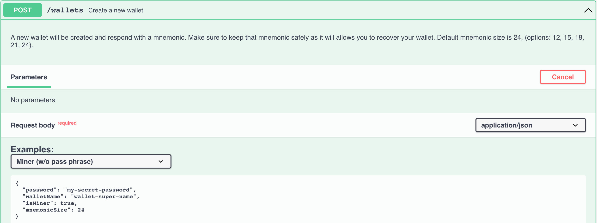
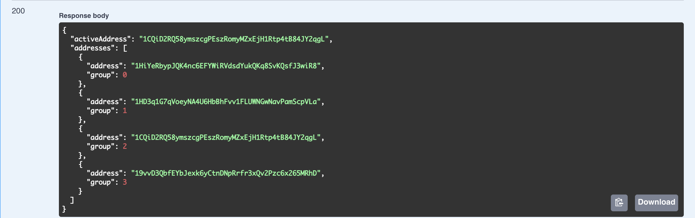
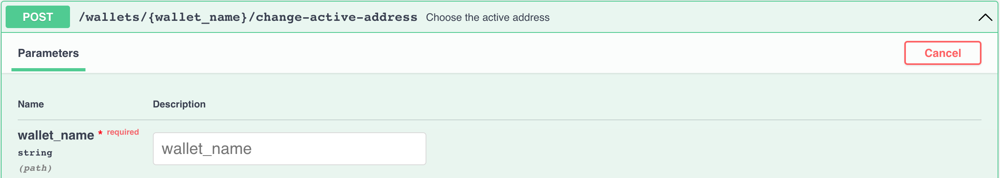
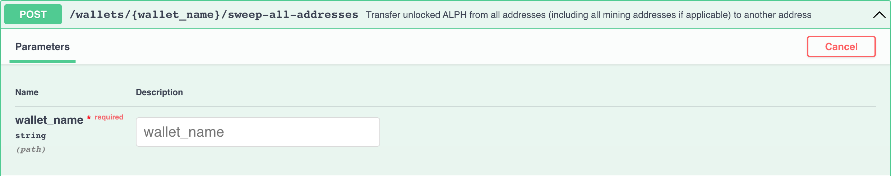
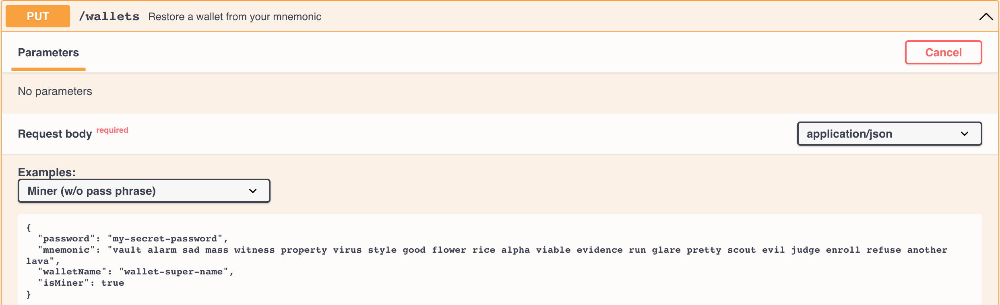

import UntranslatedPageText from "@site/src/components/UntranslatedPageText";

<UntranslatedPageText />

# Solo-Mining-Leitfaden

Sie müssen zunächst den Schritten im [Full Node Starter - Leitfaden](full-node/getting-started.md) folgen, um Ihren Knoten herunterzuladen, zu starten und Swagger [http://127.0.0.1:12973/docs](http://127.0.0.1:12973/docs) zu verwenden.

## Mining-Informationen

- Insgesamt 4 Adressgruppen und 16 Ketten
- Die Zielblockzeit beträgt 64 Sekunden
- Jeden Tag werden durchschnittlich `24 * 60 * 60 / 64 * 16 = 21600` Blöcke abgebaut
- Die Blockbelohnungen betragen derzeit 3 ALPH
- Alle abgebauten Münzen sind für 500 Minuten gesperrt

Weitere Informationen zu Mining-Belohnungen finden Sie in diesem Artikel [Block Rewards](https://medium.com/@alephium/alephium-block-rewards-72d9fb9fde33).

Sie können die geschätzte Netzwerk-Hashrate aus dem Protokoll Ihres Vollknotens oder aus dem Grafana-Dashboard des Vollknotens erhalten, wenn Sie es mit [docker-compose](full-node/docker-guide.md) ausführen.

## Miner wallet

Zunächst müssen Sie eine dedizierte Brieftasche für das Mining erstellen. Im Gegensatz zu einer _traditionellen Wallet_, hat eine _Miner Wallet_ mehrere Adressen, die für jede Adressgruppe zum Sammeln von Mining-Belohnungen verwendet werden.

#### Erstellen Sie Ihre Miner Wallet

Der Server gibt Ihnen die neue Wallet-Mnemonic zurück. Bitte sichern und speichern Sie es sicher.

#### Liste deine Miner-Adressen auf

Der Server gibt Ihnen 4 Adressen für den nächsten Schritt zurück:

## Konfigurieren Sie Miner-Adressen

Nachdem Sie Ihre 4 Miner-Adressen erhalten haben, müssen Sie diese Ihrem Knoten zuweisen, damit Sie Belohnungen erhalten, wenn er mit dem Mining beginnt. Dies kann erreicht werden, indem Sie den folgenden Inhalt in die Datei `.alephium/user.conf` unter Ihrem Home-Verzeichnis hinzufügen[^1]:

    alephium.network.external-address = "x.x.x.x:9973" // put your public IP here; otherwise remove this line
    alephium.mining.miner-addresses = [
      "1HiYeRbypJQK4nc6EFYWiRVdsdYukQKq8SvKQsfJ3wiR8",
      "1HD3q1G7qVoeyNA4U6HbBhFvv1FLUWNGwNavPamScpVLa",
      "1CQiD2RQ58ymszcgPEszRomyMZxEjH1Rtp4tB84JY2qgL",
      "19vvD3QbfEYbJexk6yCtnDNpRrfr3xQv2Pzc6x265MRhD"
    ]

Starten Sie Ihren Knoten neu, um diese neuen Konfigurationen wirksam zu machen. Achten Sie darauf, sie in derselben Reihenfolge hinzuzufügen, wie sie vom Endpunkt zurückgegeben wurden, da sie nach ihrer Gruppe sortiert sind.

## Sicherheit

Standardmäßig ist die API-Schnittstelle von Alephium an localhost gebunden, Ihre API-Endpunkte sind sicher. Wenn Sie jedoch `alephium.api.network-interface`konfiguriert haben, können Ihre Endpunkte möglicherweise dem öffentlichen Netzwerk ausgesetzt sein. Dies kann gefährlich sein, da jeder auf Ihre Miner-Brieftasche zugreifen könnte. Bitte erwägen Sie die Konfiguration eines API-Schlüssels gemäß dieser Anleitung: [API Key](full-node/full-node-more.md#api-key).

Bitte erwägen Sie auch die Erstellung einer weiteren sicheren Brieftasche und überweisen Sie regelmäßig Ihre Mittel auf diese Brieftasche mit `sweep-all-addresses` Endpoint.

## Starten Sie das Mining

### Stellen Sie sicher, dass Ihr Full Node synchronisiert ist

Sie können dies überprüfen, indem Sie diesen Endpunkt ausführen:

Wenn Sie in der Antwort `"synced": true` sehen, sind Sie bereit.

### Nvidia GPU

Bitte folgen Sie den Anweisungen auf [https://github.com/alephium/gpu-miner](https://github.com/alephium/gpu-miner#readme) um den GPU-Miner für Nvidia-GPUs auszuführen.

Alternativ können Sie den GPU-Miner mit Docker ausführen, indem Sie den Anweisungen [https://github.com/alephium/alephium/tree/master/docker#gpu-miner-optional](https://github.com/alephium/alephium/tree/master/docker#gpu-miner-optional) folgen.

### AMD GPU

Bitte folgen Sie den Anweisungen auf [https://github.com/alephium/amd-miner](https://github.com/alephium/amd-miner#readme) um den GPU-Miner für AMD-GPUs auszuführen. Beachten Sie, dass die Leistung des AMD-Miners nicht mit dem Nvidia-Miner vergleichbar ist.

Wenn Sie Fragen haben, können Sie sich gerne an die Entwickler auf [Discord](https://alephium.org/discord) wenden.

## Weitere Informationen zur Miner Wallet

Hier sind weitere Endpunkte, die für Miner nützlich sind.

#### Ihr Guthaben abfragen

#### Ändern Sie Ihre aktive Adresse

#### Übertragen Sie alle Ihre Mittel auf die aktive Adresse zu einer anderen Adresse

#### Entsperren Sie Ihre Wallet

#### Wiederherstellen der Miner Wallet

[^1]: Das Home-Verzeichnis hängt von Ihrem System ab: `C:\Users\<your-username>` in Windows, `/Users/<your-username>` in macOS, `/home/<your-username>` in Linux.
