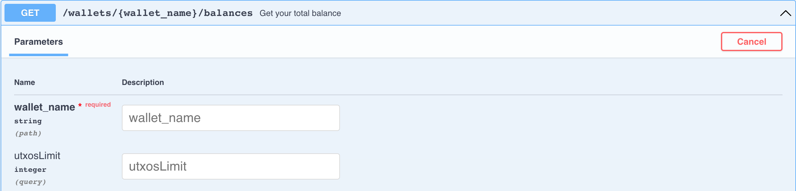

# Solo Mining Guide

:::info
Cette page n'a pas encore été traduite. Vous pouvez le faire en suivant le lien en pied de page.
:::

You must first follow the steps in the [Full Node Starter Guide](full-node/getting-started.md) in order to download, start your node and use Swagger [http://127.0.0.1:12973/docs](http://127.0.0.1:12973/docs).

## Mining information

- 4 address groups and 16 chains in total
- the target block time is 64 seconds
- everyday, `24 * 60 * 60 / 64 * 16 = 21600` blocks are mined on average
- the block rewards are 3 ALPH right now
- all of the mined coins are locked for 500 minutes

For more information about mining rewards, please read this article [Block Rewards](https://medium.com/@alephium/alephium-block-rewards-72d9fb9fde33).

You could get the estimated network hashrate from the log of your full node, or from the Grafana dashboard of the full node if you run it with [docker-compose](full-node/docker-guide.md).

## Miner wallet

First, you must create a dedicated wallet for mining. As opposed to a _traditional wallet_, a _miner wallet_ has multiple addresses which are used to collect mining rewards for each address group.

#### Create your miner wallet

The server will return you the new wallet mnemonic. Please backup and store it securely.

#### List your miner addresses

The server will return you 4 addresses for the next step:

## Configure miner addresses

Now that you have gotten your 4 miner addresses, you must assign it to your node so you can earn rewards when it starts mining. This can be done by adding the following content in the file `.alephium/user.conf` under your home folder[^1]:

    alephium.network.external-address = "x.x.x.x:9973" // put your public IP here; otherwise remove this line
    alephium.mining.miner-addresses = [
      "1HiYeRbypJQK4nc6EFYWiRVdsdYukQKq8SvKQsfJ3wiR8",
      "1HD3q1G7qVoeyNA4U6HbBhFvv1FLUWNGwNavPamScpVLa",
      "1CQiD2RQ58ymszcgPEszRomyMZxEjH1Rtp4tB84JY2qgL",
      "19vvD3QbfEYbJexk6yCtnDNpRrfr3xQv2Pzc6x265MRhD"
    ]

Please restart your node to make these new configs take effect. Please be sure to add them in the same order they were returned by the endpoint, as they are sorted according to their group.

## Security

By default, the API interface of Alephium is bound to localhost, your API endpoints are secure. However, if you configured `alephium.api.network-interface`, your endpoints might be exposed to public network. This can be dangerous as anyone would be able to access your miner wallet. Please consider to configure API Key following this guide: [API Key](full-node/full-node-more.md#api-key).

Please also consider to create another secure wallet and move your funds to that wallet using `sweep-all-addresses` endpoint regularly.

## Start mining

### Make sure your full node is synced

You could verify that by executing this endpoint:

If you see `"synced": true` in the response, then you are ready to go.

### Nvidia GPU

Please follow the instructions on [https://github.com/alephium/gpu-miner](https://github.com/alephium/gpu-miner#readme) to run the gpu miner for Nvidia GPUs.

Alternatively, you could run the gpu-miner with docker by following the documents here [https://github.com/alephium/alephium/tree/master/docker#gpu-miner-optional](https://github.com/alephium/alephium/tree/master/docker#gpu-miner-optional)

### AMD GPU

Please follow the instructions on [https://github.com/alephium/amd-miner](https://github.com/alephium/amd-miner#readme) to run the gpu miner for AMD GPUs. Note that the performance of AMD miner is not in par with Nvidia miner.

If you have any questions, feel free to reach out to the developers on [Discord](https://discord.gg/JErgRBfRSB).

## More info on miner wallet

Here are more endpoints that are useful for miners.

#### Get your balance

#### Change your active address

#### Transfer all your funds on the active address to another address

#### Unlock your wallet

#### Restore your miner wallet

[^1]: The home folder depends on your system: `C:\Users\<your-username>` in Windows, `/Users/<your-username>` in macOS, `/home/<your-username>` in Linux.
