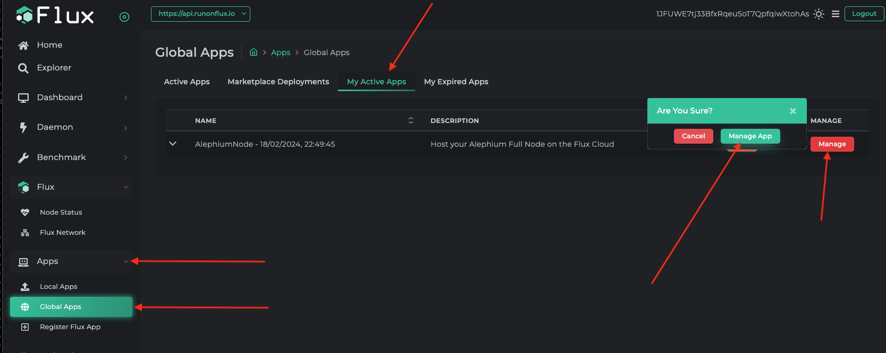
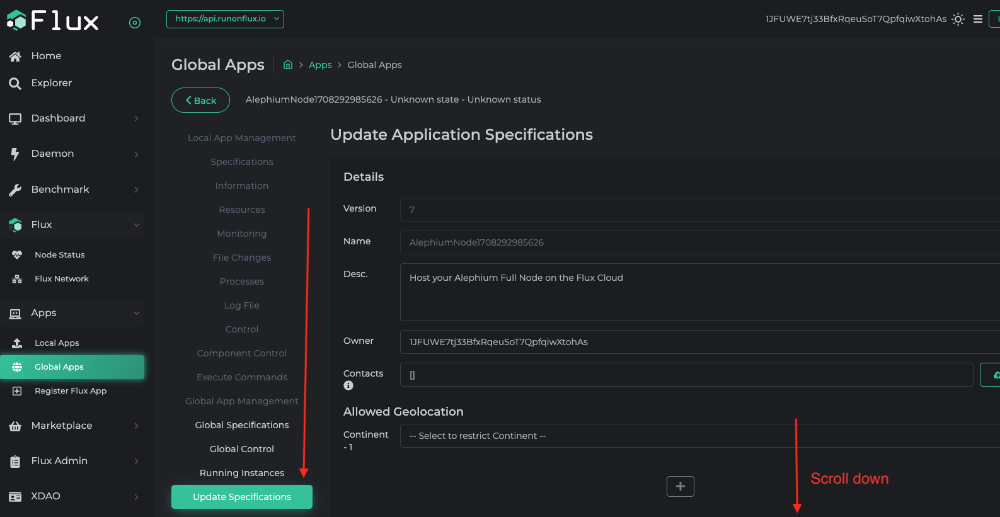
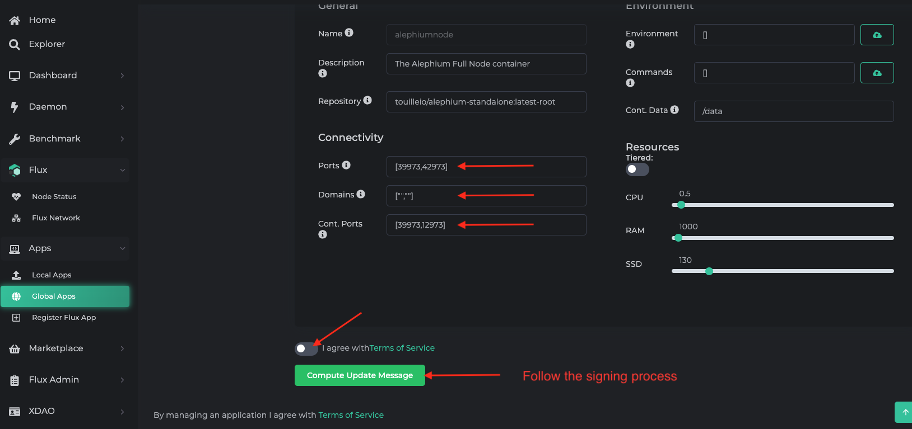
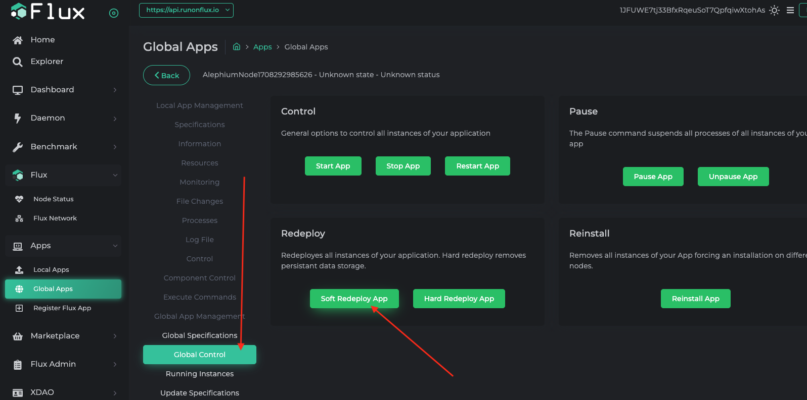

Bu kılavuzda, [Flux](https://runonflux.io/) üzerinde bir tam düğümü nasıl çalıştıracağımızı ve API'yi nasıl açacağımızı öğreneceğiz.

Flux ile başlamanın nasıl yapılacağı bu sayfanın kapsamı dışındadır, ancak ihtiyacınız olursa Flux'un resmi belgelerine başvurabilirsiniz. Burada, bir Uygulama başlatmak için yeterli Flux'a sahip olduğunuzu varsayacağız.

## Pazar Yerinden Tam Düğüm Uygulamasını Alın

[https://home.runonflux.io/apps/marketplace?q=alephium](https://home.runonflux.io/apps/marketplace?q=alephium)
*AlephiumNode* adındaki Uygulamayı seçin.

## API'yi Açma

Varsayılan olarak, Tam Düğüm Uygulamasının yalnızca P2P bağlantı noktası (Flux düğümlerinde 39973) açıktır. API bağlantı noktasını açmak istiyorsanız, Flux Uygulamanızın belirtimini aşağıdaki gibi güncellemeniz gerekir. API'nin açılması, ne yaptığınızı biliyorsanız bir güvenlik endişesi olabilir.

1. Uygulamanızı yönetin

2. Belirtimleri güncelleyin

3. Bağlantıyı yapılandırın ve konteyner bağlantı noktası 12973'ü açın. Aşağıdaki ekran görüntüsünde, bağlantı noktası 42973 belirtilmiş ve API'nin açılacağı belirtilmiştir. Başka herhangi bir geçerli bağlantı noktası da çalışacaktır. Belirtim güncellemesini ağ üzerinde yayınlamak için imzalama işlemini yapın ve takip edin.

4. Belirtim güncellemesini dikkate almak için uygulamanızı hafifçe yeniden dağıtın.

Bu kadar, API'niz artık Otomatik uç nokta aracılığıyla `_42973` (veya belirlediğiniz farklı bağlantı noktası) içerir şekilde açılmıştır. API uç noktasını `/infos/version` gibi kolayca doğrulayabilirsiniz, yani `https://alephiumnode1708292985626_42973.app.runonflux.io/infos/version` gibi bir şey.
