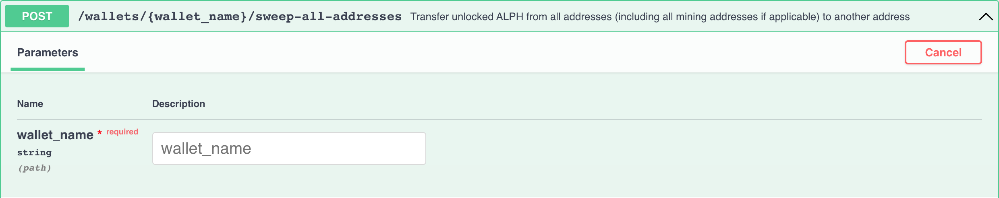

# Solo Madencilik Kılavuzu

İlk olarak, [Tam Düğüm Başlangıç Kılavuzu](full-node/getting-started.md) adımlarını izlemeniz gerekmektedir. Bunu yaparak düğümünüzü indirebilir, başlatabilir ve Swagger [http://127.0.0.1:12973/docs](http://127.0.0.1:12973/docs) kullanabilirsiniz.

## Madencilik bilgileri

- Toplamda 4 adres grubu ve 16 zincir bulunmaktadır
- Hedef blok süresi 64 saniyedir
- Her gün ortalama olarak `24 * 60 * 60 / 64 * 16 = 21600` blok üretilmektedir
- Blok ödülleri şu anda 3 ALPH'tır
- Üretilen tüm paralar 500 dakika boyunca kilitlidir

Daha fazla bilgi için lütfen bu makaleyi okuyun: [Blok Ödülleri](https://medium.com/@alephium/alephium-block-rewards-72d9fb9fde33).

Ağ hash oranını tahmini olarak tam düğümünüzün günlük tutanaklarından veya tam düğümün Grafana gösterge tablosundan alabilirsiniz, eğer [docker-compose](full-node/docker-guide.md) ile çalıştırırsanız.

## Madenci cüzdanı

Öncelikle, madencilik için ayrılmış bir cüzdan oluşturmanız gerekmektedir. _Geleneksel bir cüzdanın_ aksine, bir _madenci cüzdanı_, her adres grubu için madencilik ödülleri toplamak için kullanılan birden fazla adres içerir.

#### Madenci cüzdanınızı oluşturun

Sunucu size yeni cüzdanın ezgilerini döndürecektir. Lütfen bunu yedekleyin ve güvenli bir şekilde saklayın.

#### Madenci adreslerinizi listeleme

Sunucu size bir sonraki adımlar için 4 adres döndürecektir:

## Madenci adreslerini yapılandırma

Şimdi 4 madenci adresinizi aldığınıza göre, düğümünüze atayarak madencilik yaparken ödül alabilirsiniz. Bunun için `.alephium/user.conf` dosyasına aşağıdaki içeriği eklemeniz gerekmektedir, ev klasörünüz altında[^1]:

    alephium.network.external-address = "x.x.x.x:9973" // buraya genel IP'nizi yazın; aksi halde bu satırı kaldırın
    alephium.mining.miner-addresses = [
      "1HiYeRbypJQK4nc6EFYWiRVdsdYukQKq8SvKQsfJ3wiR8",
      "1HD3q1G7qVoeyNA4U6HbBhFvv1FLUWNGwNavPamScpVLa",
      "1CQiD2RQ58ymszcgPEszRomyMZxEjH1Rtp4tB84JY2qgL",
      "19vvD3QbfEYbJexk6yCtnDNpRrfr3xQv2Pzc6x265MRhD"
    ]

Bu yeni yapılandırmaların etkili olması için lütfen düğümünüzü yeniden başlatın. Lütfen bunları aynı sırayla eklediğinizden emin olun, çünkü adresler gruplarına göre sıralanmıştır.

## Güvenlik

Varsayılan olarak, Alephium'un API arayüzü localhost'a bağlıdır, API uç noktalarınız güvenlidir. Ancak, `alephium.api.network-interface`'i yapılandırdıysanız, uç noktalarınız genel ağa açık hale gelebilir. Bu, herhangi birinin madenci cüzdanınıza erişebileceği tehlikeli olabilir. Lütfen API Anahtarını yapılandırmak için bu kılavuzu takip etmeyi düşünün: [API Anahtarı](full-node/full-node-more.md#api-key).

Lütfen ayrıca düzenli olarak `sweep-all-addresses` uç noktasını kullanarak başka bir güvenli cüzdana daha fonlarınızı taşımayı düşünün.

## Madenciliği Başlatma

### Tam düğümünüzün senkronize olduğundan emin olun

Bunu yaparak, bu uç noktayı yürüterek doğrulayabilirsiniz:

Yanıtta `"synced": true` görürseniz, o zaman hazırsınız demektir.

### Nvidia GPU

Nvidia GPU'lar için gpu madencisini çalıştırmak için lütfen [https://github.com/alephium/gpu-miner](https://github.com/alephium/gpu-miner#readme) talimatlarını izleyin.

Alternatif olarak, gpu-mineri docker ile çalıştırarak bu belgeleri takip edebilirsiniz: [https://github.com/alephium/alephium/tree/master/docker#gpu-miner-optional](https://github.com/alephium/alephium/tree/master/docker#gpu-miner-optional)

### AMD GPU

AMD GPU'lar için gpu madencisini çalıştırmak için lütfen [https://github.com/alephium/amd-miner](https://github.com/alephium/amd-miner#readme) talimatlarını izleyin. AMD madencinin performansının Nvidia madencinin performansıyla aynı olmadığını unutmayın.

Herhangi bir sorunuz varsa, geliştiricilerle [Discord](https://alephium.org/discord) üzerinden iletişime geçmekten çekinmeyin.

## Madenci cüzdanı hakkında daha fazla bilgi

İşte madenciler için kullanışlı olan daha fazla uç nokta.

#### Bakiyenizi alın

#### Etkin adresinizi değiştirme

#### Etkin adreste bulunan tüm fonları başka bir adrese aktarın

#### Cüzdanınızı kilidini açın

#### Madenci cüzdanınızı geri yükleyin

[^1]: Ev klasörü sistemlerinize bağlıdır: Windows'ta `C:\Users\<kullanıcı-adınız>`, macOS'te `/Users/<kullanıcı-adınız>`, Linux'ta `/home/<kullanıcı-adınız>`.
